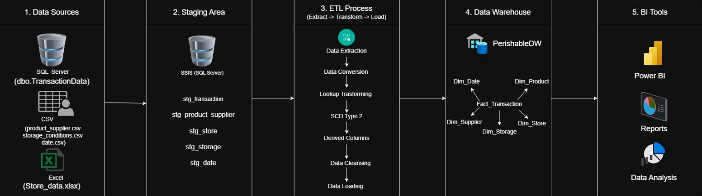
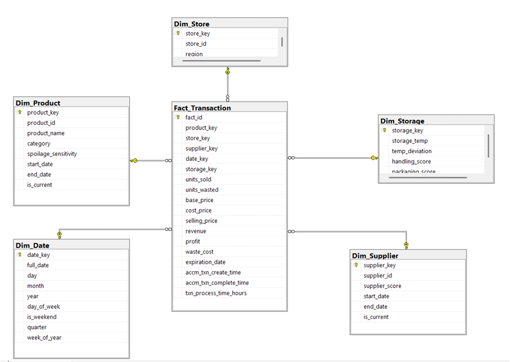
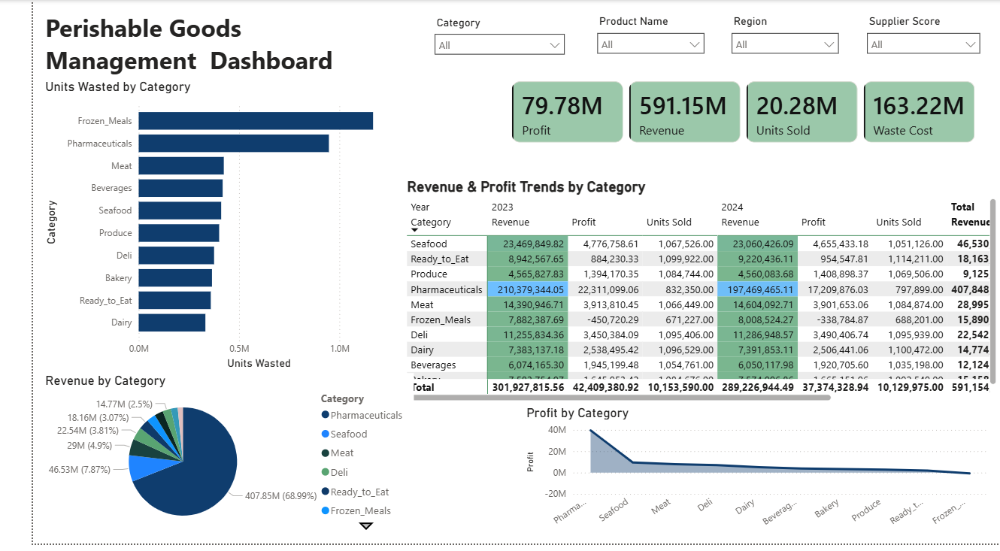
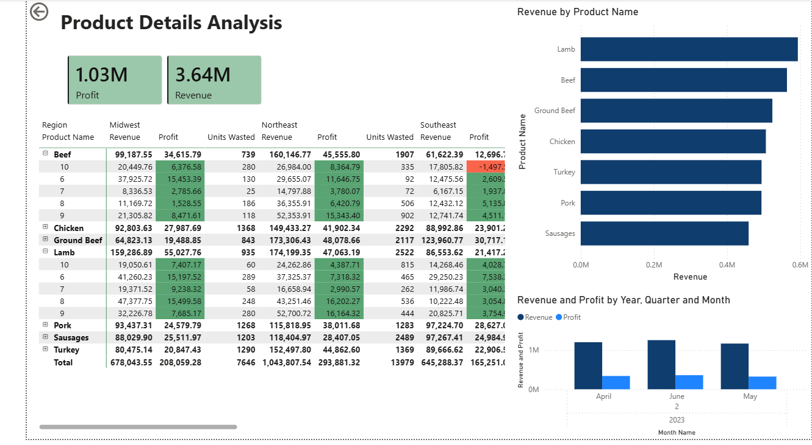

# Perishable Goods Data Warehouse

## Project Overview

A complete Data Warehousing and Business Intelligence solution
implemented using SQL Server, SSIS, SSAS, Excel OLAP, and Power BI.

## Business Problem

Perishable goods retailers must balance product availability, profitability, and waste reduction while managing products with limited shelf life. Operational data is often distributed across multiple systems, making analysis difficult.

This project develops a Data Warehouse and Business Intelligence solution to centralize transactional, supplier, store, storage, and date-related data. The solution enables analysis of revenue, profit, waste, supplier performance, and product expiration trends through SSAS cubes, OLAP operations, and Power BI dashboards, supporting better business decision-making.

## Technologies used 

- SQL Server
- SSIS
- SSAS Multidimensional Cube
- Excel OLAP
- Power BI

## Features

- Star Schema Data Warehouse
- Slowly Changing Dimension (Type 2)
- ETL Pipelines
- Accumulating Fact Table
- SSAS Cube
- OLAP Operations
- Interactive Power BI Dashboards

## Solution Architecture

## Data Warehouse Star Schema

## Power BI Reports

### Report 1
Matrix Visual

### Report 2
Slicers and Cascading Filters

### Report 3
Drill Down Analysis

### Report 4
Drill Through Analysis

## Results & Insights

The solution enables:

- Product profitability analysis
- Waste and spoilage monitoring
- Supplier performance evaluation
- Regional sales analysis
- Revenue trend analysis
- Expiration and shelf-life tracking

Power BI dashboards provide interactive exploration through
drill-down, drill-through, matrix analysis and cascading slicers.

## Author

Durangi Abeykoon

BSc (Hons) Information Technology
Sri Lanka Institute of Information Technology (SLIIT)

Module:
IT3021 - Data Warehousing and Business Intelligence
